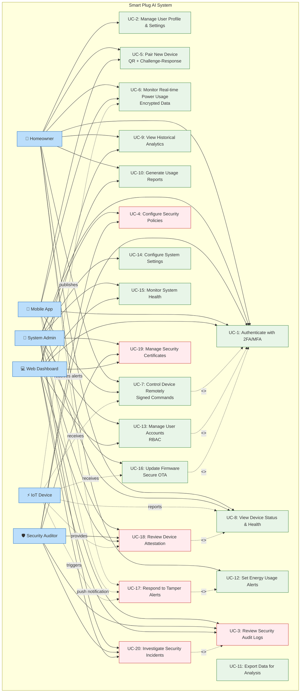

# Use Case Diagrams

This folder contains use case diagrams that illustrate the interactions between users, systems, and the Smart Plug AI platform.

## Overview

Use case diagrams document the functional requirements from the user's perspective, showing:
- System actors (users, devices, services)
- Use cases (functional requirements)
- Relationships between actors and use cases
- System boundaries

## Recommended Tools

- **Primary**: Visual Paradigm Community Edition - Excellent UML support with auto-layout
- **Backup**: Diagrams.net - Web-based alternative for quick edits

## Diagrams in this Folder

### Main Diagrams
- **1.1_System_Use_Case.vpp** - Complete system overview with all actors and use cases
- **1.2_User_Use_Case.vpp** - User-focused interactions
- **1.3_Admin_Use_Case.vpp** - Administrator operations

### Additional Diagrams (Markdown)
- **authentication_security.md** - Authentication & Security use cases
- **device_management.md** - Device Management use cases
- **data_analytics.md** - Data Analytics & Reporting use cases
- **security_operations.md** - Security Operations Center use cases

## System Overview Use Case Diagram

The following Mermaid diagram provides a high-level overview of the Smart Plug AI system with all primary actors and use cases:

## Primary Actors

1. **Homeowner** - Primary user, residential customer
2. **Facility Manager** - Commercial/industrial user
3. **System Administrator** - Technical administrator
4. **Security Auditor** - Compliance and security reviewer
5. **IoT Device** - ESP32-S3 smart plug
6. **Mobile Application** - Flutter-based mobile interface
7. **Web Dashboard** - React-based admin interface

## Main Use Case Domains

### Authentication & Security Domain
- UC-1: Authenticate with 2FA/MFA
- UC-2: Manage User Profile & Settings
- UC-3: Review Security Audit Logs
- UC-4: Configure Security Policies

### Device Management Domain
- UC-5: Pair New Device (QR + Challenge-Response)
- UC-6: Monitor Real-time Power Usage
- UC-7: Control Device Remotely (Signed Commands)
- UC-8: View Device Status & Health

### Data & Analytics Domain
- UC-9: View Historical Analytics
- UC-10: Generate Usage Reports
- UC-11: Export Data for Analysis
- UC-12: Set Energy Usage Alerts

### System Administration Domain
- UC-13: Manage User Accounts (RBAC)
- UC-14: Configure System Settings
- UC-15: Monitor System Health
- UC-16: Update Firmware (Secure OTA)

### Security Operations Domain
- UC-17: Respond to Tamper Alerts
- UC-18: Review Device Attestation Status
- UC-19: Manage Security Certificates
- UC-20: Investigate Security Incidents

## Security Features

All use cases incorporate comprehensive security features:
- **Hardware-based security** with ATECC608A secure element
- **Challenge-response authentication** for device pairing
- **ECDSA P256 signatures** for command verification
- **Mutual TLS 1.3** for all communications
- **Role-based access control** (RBAC)
- **Comprehensive audit logging**
- **Tamper detection and response**

## Usage Notes

For creating or editing use case diagrams:
1. Open Visual Paradigm Community Edition
2. Create new Use Case Diagram
3. Add actors from the palette (stick figures)
4. Add use cases (ovals)
5. Connect with associations (solid lines)
6. Use <<include>> and <<extend>> for relationships
7. Define system boundary with a rectangle
8. Export to PDF/PNG for presentations

## References

See `diagram_specifications.txt` in the parent directory for complete diagram specifications and additional details.
