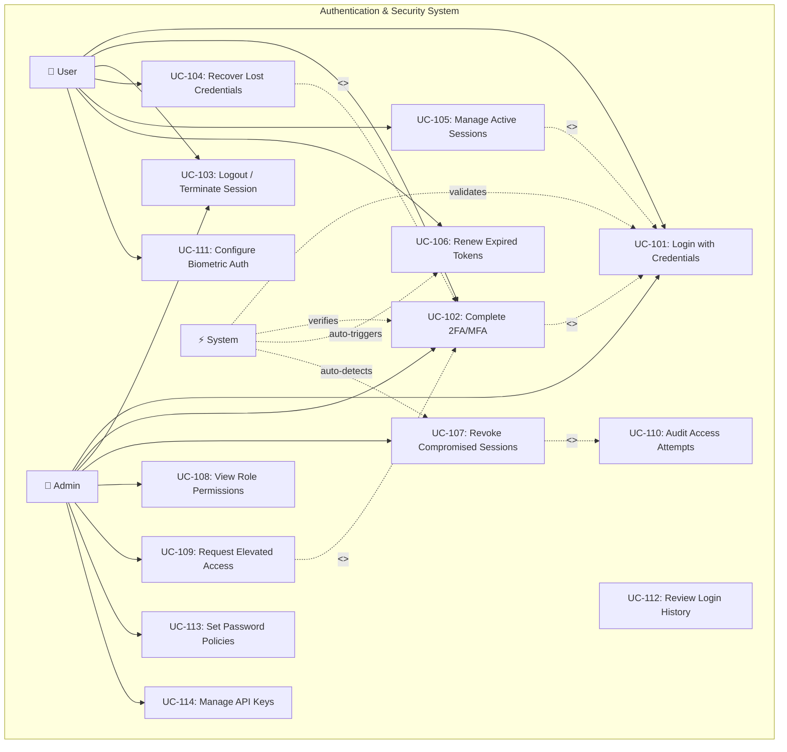

# Authentication & Security Use Case Diagram

This diagram focuses on authentication and security-related use cases in the Smart Plug AI system.

## Overview

This use case diagram illustrates the authentication flow, session management, access control, and security features that protect the Smart Plug AI platform.

## Mermaid Diagram

## 2FA/MFA Options

- **TOTP** (Google Authenticator)
- **SMS Verification**
- **Push Notification**
- **Biometric Verification**

## RBAC Roles

- **Admin**: Full system access
- **User**: Device management
- **Viewer**: Read-only
- **Auditor**: Security logs only
- **Service**: API access

## Security Features

- TLS 1.3 for all communications
- Rate limiting: 5 attempts per 15 minutes
- JWT tokens with short expiry
- Refresh token rotation
- Biometric integration
- Session anomaly detection
- Audit logging of all authentication attempts
