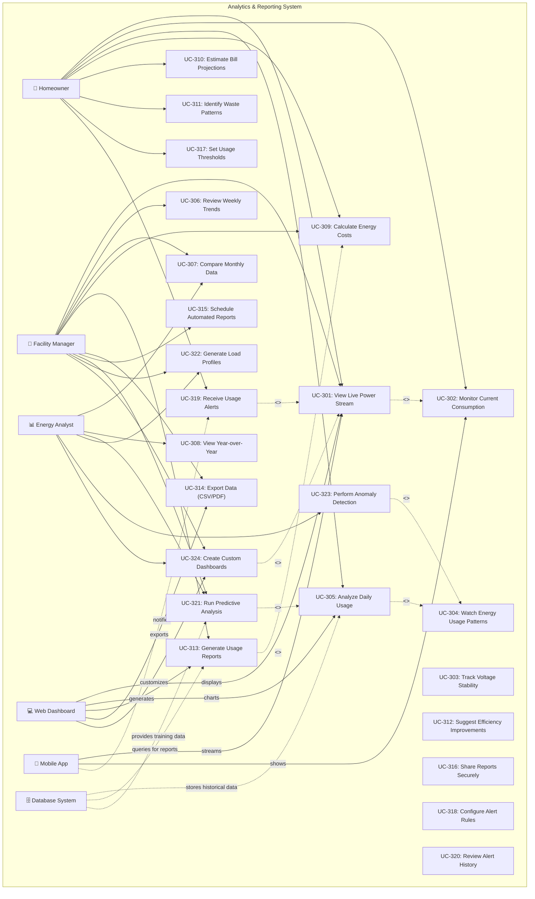

# Data Analytics Use Case Diagram

This diagram illustrates the analytics and reporting capabilities of the Smart Plug AI platform.

## Overview

This use case diagram shows real-time monitoring, historical analysis, cost tracking, reporting, alerting, and advanced analytics features.

## Mermaid Diagram

<!-- Note: This diagram contains comprehensive data analytics use cases with real-time data flow and anomaly detection features -->

## Real-time Data Flow

1. Device → MQTT over TLS 1.3
2. Backend → WebSocket over TLS
3. Client → Encrypted display
4. Database → Encrypted at rest
5. Analytics → Field-level encryption

## Anomaly Detection

The system monitors for:
- Unusual power spikes
- Unexpected consumption patterns
- Tamper detection via MAX6316
- Firmware integrity violations
- Network security anomalies

## Security Features

- End-to-end encryption for all data
- Field-level encryption for sensitive information
- Real-time anomaly detection
- Secure data aggregation
- Encrypted exports
- Access control for reports
