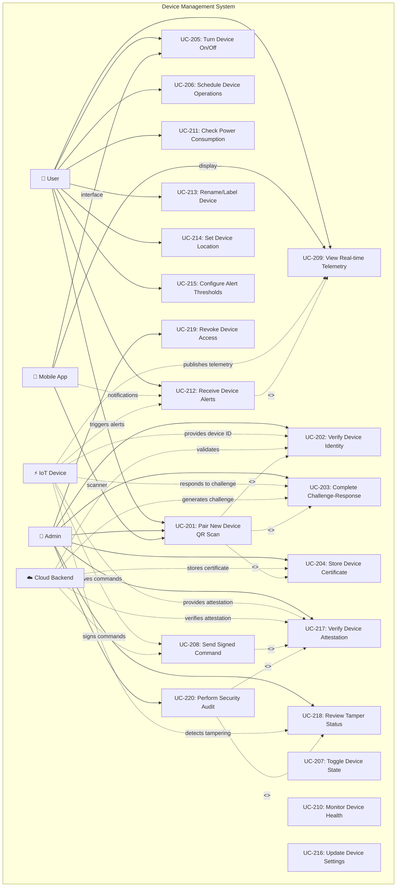

# Device Management Use Case Diagram

This diagram details device management operations including pairing, control, monitoring, and security.

## Overview

This use case diagram shows how users interact with IoT devices through the Smart Plug AI platform, including secure pairing, real-time monitoring, remote control, and security verification.

## Mermaid Diagram

<!-- Note: This diagram was copied from source_d24e744d.txt and contains the complete device management use case specification -->

## Secure Pairing Flow

1. Device shows QR with ID + challenge
2. Mobile app scans QR
3. App sends to backend for verification
4. Backend signs challenge response
5. Device verifies with ATECC608A
6. Certificate exchange completes

## Signed Command Process

1. User initiates command in app
2. Backend signs with ECDSA private key
3. Command sent via MQTT over TLS 1.3
4. Device verifies with server public key
5. ATECC608A validates signature
6. Command executed if valid

## Security Features

- Hardware-based key storage (ATECC608A)
- Challenge-response anti-replay
- ECDSA P256 signatures
- Mutual authentication
- Device attestation
- TLS 1.3 encryption
