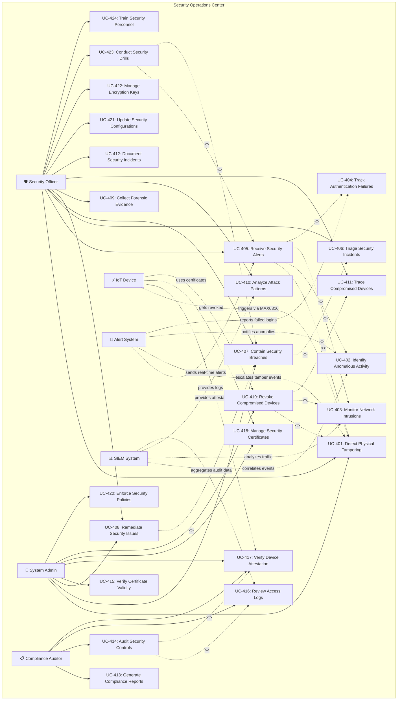

# Security Operations Use Case Diagram

This diagram covers security operations, threat detection, incident response, and compliance.

## Overview

This use case diagram illustrates the Security Operations Center (SOC) capabilities, including threat detection, incident response, forensics, compliance auditing, and device security management.

## Mermaid Diagram

<!-- Note: This diagram includes comprehensive security operations with tamper detection flow and device attestation -->

## Security Framework Compliance

- **NIST Cybersecurity Framework**
- **OWASP IoT Security Top 10**
- **SABS/ICASA Compliance**
- **SOC2 Type II Controls**
- **POPIA/GDPR Data Protection**
- **Certificates**: ECDSA P256, TLS 1.3

## Tamper Detection Flow

1. MAX6316 detects enclosure opening
2. Triggers ESP32 reset
3. Sends tamper alert via MQTT/TLS
4. Backend logs security event
5. User notified via push notification
6. Device marked as 'tampered'
7. Requires re-verification

## Device Attestation

- Firmware hash verification
- Secure boot status check
- Flash encryption status
- ATECC608A key validation
- Certificate chain verification
- Reported every 24h

## Security Features

- Hardware tamper detection
- Immediate response (<100ms)
- Secure erase capability
- Multi-channel notifications
- Forensic logging
- Manual security review
- Challenge-response re-verification
