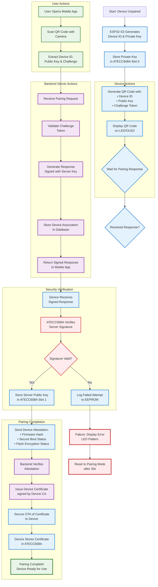

# Activity Diagrams

This folder contains activity diagrams that illustrate process flows and workflows in the Smart Plug AI system.

## Overview

Activity diagrams show the sequence of actions and decisions in various system processes, including:
- Secure device pairing
- Command execution
- Tamper detection and response
- OTA firmware updates
- Real-time telemetry flow
- User authentication

## Recommended Tools

- **Primary**: Visual Paradigm Community Edition - Professional UML notation support
- **Backup**: UMLet - Lightweight alternative for activity diagrams

## Diagrams in this Folder

### Main Diagrams
- **2.1_Device_Pairing_Flow.vpp** - Complete secure pairing workflow
- **2.2_Secure_Command_Flow.vpp** - Command execution with signature verification
- **2.3_Tamper_Response_Flow.vpp** - Tamper detection and incident response

## Secure Device Pairing Activity Diagram

The following Mermaid flowchart illustrates the complete secure device pairing process with challenge-response authentication:

<!-- Note: This diagram was copied from source_d24e744d.txt - hardware-based security with ATECC608A -->

## Security Notes

**Critical Security Features in Device Pairing:**
- ATECC608A prevents key extraction
- ECDSA P256 signatures
- Challenge-response prevents replay attacks
- Device attestation ensures integrity
- Hardware-based trust anchor
- Certificate-based authentication
- Mutual authentication (device ↔ server)

## Process Flow Steps

### Phase 1: Device Initialization
1. ESP32-S3 generates unique device ID
2. ATECC608A generates device key pair
3. Private key stored securely in hardware (never leaves chip)
4. QR code generated with device ID, public key, and challenge

### Phase 2: User Scans QR
1. User opens mobile app
2. Scans QR code with camera
3. Extracts device credentials

### Phase 3: Backend Challenge-Response
1. App sends pairing request to backend
2. Backend validates challenge token
3. Server signs response with its private key
4. Response sent back to mobile app

### Phase 4: Device Verification
1. Device receives signed response
2. ATECC608A verifies server's signature
3. If valid, stores server's public key
4. If invalid, logs failure and resets

### Phase 5: Device Attestation
1. Device generates attestation report
2. Includes firmware hash, secure boot status, encryption status
3. Signed with device's private key
4. Sent to backend for verification

### Phase 6: Certificate Issuance
1. Backend verifies attestation
2. Issues device certificate signed by CA
3. Certificate sent to device via secure OTA
4. Device stores certificate in ATECC608A

### Phase 7: Completion
1. Device marked as paired and active
2. Ready to receive commands
3. Can publish telemetry
4. User notified of successful pairing

## Error Handling

- **Invalid Signature**: Device logs failed attempt, displays error LED pattern, resets after 30s
- **Network Timeout**: Device queues request for retry
- **Attestation Failure**: Backend rejects device, requires manual security review
- **Certificate Storage Failure**: Device attempts rollback and retry

## References

See `source_d24e744d.txt` in the parent directory for additional activity diagrams including:
- Secure command execution flow
- Tamper detection and response
- OTA firmware update process
- Real-time telemetry data flow
- User authentication with 2FA
