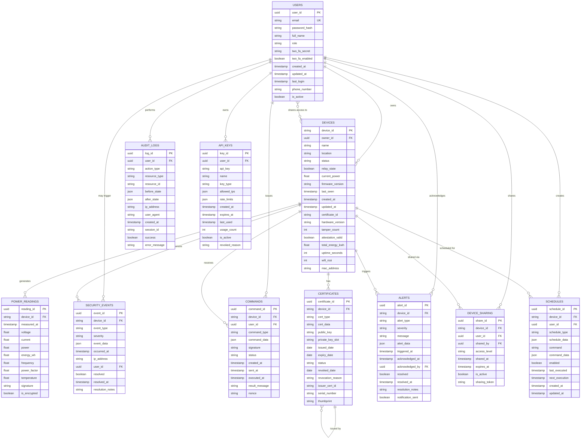

# Class & ER Diagrams

This folder contains class diagrams and entity-relationship diagrams for the Smart Plug AI system.

## Overview

These diagrams document:
- Database schema and relationships (ER Diagrams)
- Object-oriented class structures (Class Diagrams)
- Domain models and business logic
- Service layer architecture
- Security components

## Recommended Tools

- **Primary**: Visual Paradigm Community Edition - Superior database modeling tools
- **Backup**: Diagrams.net - Alternative for quick edits

## Diagrams in this Folder

### Main Diagrams
- **3.1_Class_Diagram_Backend.vpp** - Backend service layer classes
- **3.2_Class_Diagram_Firmware.vpp** - ESP32 firmware classes
- **3.3_ER_Diagram_Database.vpp** - Complete database schema
- **3.4_SQL_DDL_Generated.sql** - SQL Data Definition Language file (generated from ER diagram)

## Entity-Relationship Diagram

The following Mermaid ER diagram shows the complete database schema for Smart Plug AI:

<!-- Note: This diagram was copied from source_d24e744d.txt - includes all security fields and relationships -->

## SQL DDL File Reference

The complete SQL Data Definition Language (DDL) file is available at:
`3.4_SQL_DDL_Generated.sql`

This file includes:
- Table creation statements with all fields
- Primary key and foreign key constraints
- Indexes for performance optimization
- Check constraints for data validation
- Default values and auto-increment settings
- Comments and documentation

**Note**: The SQL DDL file is a placeholder that should be generated from the ER diagram using Visual Paradigm's database generation features.

## Key Entities

### Core Entities

1. **USERS** - User accounts with authentication and RBAC
2. **DEVICES** - IoT smart plug device registry
3. **POWER_READINGS** - Time-series telemetry data
4. **SECURITY_EVENTS** - Security incidents and tamper events
5. **COMMANDS** - Device control commands with signatures

### Security Entities

6. **CERTIFICATES** - X.509 certificates for device authentication
7. **AUDIT_LOGS** - Comprehensive audit trail
8. **API_KEYS** - API access tokens with rate limits

### Feature Entities

9. **ALERTS** - User-configured alerts and notifications
10. **SCHEDULES** - Automation rules and time-based commands
11. **DEVICE_SHARING** - Multi-user device access control

## Security Features in Database Design

- **Field-level Encryption**: Sensitive fields encrypted at rest
- **Audit Logging**: Complete trail of all data modifications
- **Tamper Tracking**: tamper_count and security event logging
- **Certificate Management**: Full PKI certificate lifecycle
- **RBAC Integration**: Role-based access control in user table
- **2FA Support**: two_fa_secret and two_fa_enabled fields
- **Signature Verification**: Signature fields for data integrity

## Indexes and Performance

Key indexes for performance (see SQL DDL file for complete list):
- `idx_devices_status` - Fast device status queries
- `idx_power_readings_device_time` - Efficient telemetry queries
- `idx_security_events_device_time` - Security event monitoring
- `idx_certificates_expiry` - Certificate expiration checks
- `idx_alerts_device_active` - Active alert queries

## Relationships

### One-to-Many Relationships
- USERS → DEVICES (owner_id)
- DEVICES → POWER_READINGS
- DEVICES → SECURITY_EVENTS
- DEVICES → COMMANDS
- USERS → AUDIT_LOGS

### Many-to-Many Relationships
- USERS ↔ DEVICES (via DEVICE_SHARING for shared access)

### Self-Referencing
- CERTIFICATES → CERTIFICATES (certificate chain: issuer_cert_id)

## References

For complete class diagram specifications and service layer architecture, see `diagram_specifications.txt` in the parent directory, which includes:
- Backend service layer class diagrams
- Security components class diagram
- Firmware class structures
- Data transfer objects (DTOs)
- Repository patterns
