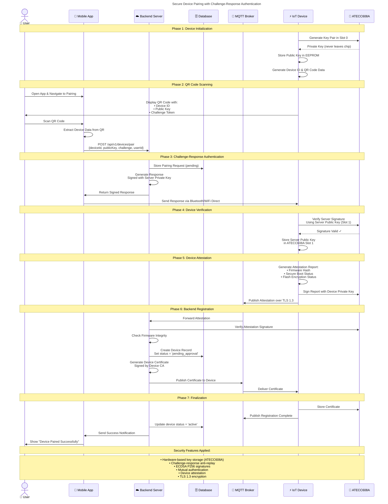

# Sequence Diagrams

This folder contains sequence diagrams that show interactions between components over time.

## Overview

Sequence diagrams illustrate:
- Message passing between objects
- Temporal ordering of interactions
- Lifelines and activation boxes
- Synchronous and asynchronous calls
- Security verification flows

## Recommended Tools

- **Primary**: Visual Paradigm Community Edition - Best sequence diagram generation
- **Backup**: UMLet - Lightweight alternative

## Diagrams in this Folder

### Main Diagrams
- **4.1_Secure_Control_Sequence.vpp** - Command execution with ECDSA signatures
- **4.2_Tamper_Detection_Sequence.vpp** - Tamper event handling flow
- **4.3_OTA_Update_Sequence.vpp** - Secure firmware update process

## Secure Device Pairing Sequence Diagram

The following Mermaid sequence diagram shows the complete secure device pairing flow with challenge-response authentication:

<!-- Note: This diagram was copied from source_d24e744d.txt - includes ATECC608A hardware security -->

## Sequence Diagram Phases

### Phase 1: Device Initialization
- Device generates unique cryptographic key pair in ATECC608A
- Private key never leaves the secure element
- Public key and device ID encoded in QR code

### Phase 2: QR Code Scanning
- User scans QR code with mobile app
- App extracts device credentials
- Pairing request sent to backend

### Phase 3: Challenge-Response Authentication
- Backend validates challenge token
- Server signs response with its private key
- Anti-replay protection via challenge-response

### Phase 4: Device Verification
- Device uses ATECC608A to verify server's signature
- Hardware-based signature verification
- Server's public key stored securely

### Phase 5: Device Attestation
- Device generates attestation report
- Proves firmware integrity and security status
- Signed with device's private key

### Phase 6: Backend Registration
- Backend verifies attestation
- Issues device certificate from CA
- Certificate delivered over secure channel

### Phase 7: Finalization
- Certificate stored in ATECC608A
- Device marked as active in database
- User receives success notification

## Security Features

- **Hardware Security**: ATECC608A secure element prevents key extraction
- **Challenge-Response**: Prevents replay attacks
- **ECDSA P256**: Industry-standard elliptic curve signatures
- **Mutual Authentication**: Both device and server verify each other
- **Device Attestation**: Proves device integrity before activation
- **TLS 1.3**: All network communication encrypted
- **Certificate-based**: PKI infrastructure for device identity

## Additional Sequences

See `diagram_specifications.txt` in the parent directory for additional sequence diagrams:
- **Secure Command Execution**: MQTT command flow with signature verification
- **Tamper Detection & Response**: Hardware tamper detection and incident response
- **Secure OTA Update**: Firmware update with rollback protection
- **Real-time Telemetry Flow**: Data collection and distribution
- **User Authentication with 2FA**: Multi-factor authentication flow

## Usage Notes

For creating sequence diagrams in Visual Paradigm:
1. Create New Diagram → Sequence Diagram
2. Add participants from the palette
3. Draw messages between lifelines
4. Add activation boxes for processing
5. Use notes for phase descriptions
6. Add alternative/optional fragments for error handling
7. Export to PDF/PNG for documentation

## References

All sequence diagrams follow UML 2.5 specification with emphasis on security verification steps and hardware component interactions.
