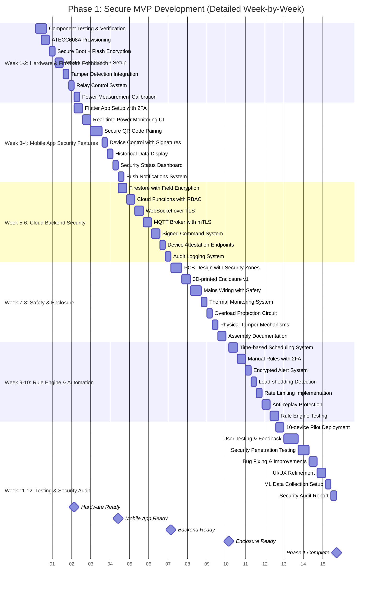

# Gantt Charts

This folder contains project timeline and scheduling diagrams for Smart Plug AI development.

## Overview

Gantt charts provide:
- Project timelines and milestones
- Task dependencies and sequencing
- Resource allocation over time
- Phase-based development planning
- Security milestone tracking

## Recommended Tools

- **Primary**: Visual Paradigm Community Edition - Built-in project management features
- **Backup**: Diagrams.net - Alternative for timeline visualization

## Diagrams in this Folder

### Main Diagrams
- **6.1_Project_Timeline.vpp** - Complete project timeline (Phases 1-3)
- **6.2_Phase1_Detailed.vpp** - Detailed Phase 1 breakdown (Weeks 1-12)

## Phase 1: Detailed Gantt Chart (Weeks 1-12)

The following Mermaid Gantt chart shows the detailed week-by-week timeline for Phase 1 (Secure MVP Development):

<!-- Note: This diagram was copied from source_d24e744d.txt - shows complete Phase 1 security milestones -->

## Phase 1 Overview

**Duration**: 12 weeks (January - April 2025)  
**Budget**: R5,000  
**Goal**: Secure MVP with 3 functional prototypes

### Key Milestones

1. **Week 2**: Hardware components tested and ATECC608A provisioned
2. **Week 4**: Mobile app with secure pairing functional
3. **Week 6**: Cloud backend with full security stack operational
4. **Week 8**: Physical enclosure with tamper detection complete
5. **Week 10**: Automation and rule engine tested
6. **Week 12**: Security audit passed, MVP ready for Phase 2

## Security Milestones

Critical security implementations by week:
- **Week 1**: Secure boot, flash encryption, ATECC608A
- **Week 2**: MQTT over TLS 1.3, tamper detection
- **Week 4**: 2FA, QR pairing, signed commands
- **Week 6**: mTLS, device attestation, audit logging
- **Week 10**: Rate limiting, anti-replay protection
- **Week 12**: Penetration testing, security audit

## Phases 2 & 3

### Phase 2: Pilot & Refinement (Months 5-8)
- Production-ready PCB design
- 500-device pilot deployment
- SABS/ICASA certification
- Advanced analytics features
- Budget: R3,000,000

### Phase 3: Commercial Launch (Months 9-12)
- First 10,000 units manufactured
- Retail partnerships established
- Enterprise features
- SOC2 Type I certification
- Budget: R6,000,000

## Risk Management

Key risks tracked in timeline:
- **Technical**: Hardware failures, software bugs
- **Security**: Vulnerabilities, penetration test failures
- **Regulatory**: SABS/ICASA approval delays
- **Supply Chain**: Component availability
- **Market**: Customer adoption, competitor response

## Usage Notes

For creating Gantt charts in Visual Paradigm:
1. Create New Diagram → Gantt Chart
2. Add tasks with start dates and durations
3. Define dependencies between tasks
4. Add milestones for key dates
5. Assign resources to tasks
6. Export to PDF or image formats

## References

See `diagram_specifications.txt` for additional timeline diagrams including:
- Security milestone timeline
- Risk management timeline
- Deliverable timeline
- Complete Phase 2 & 3 schedules
